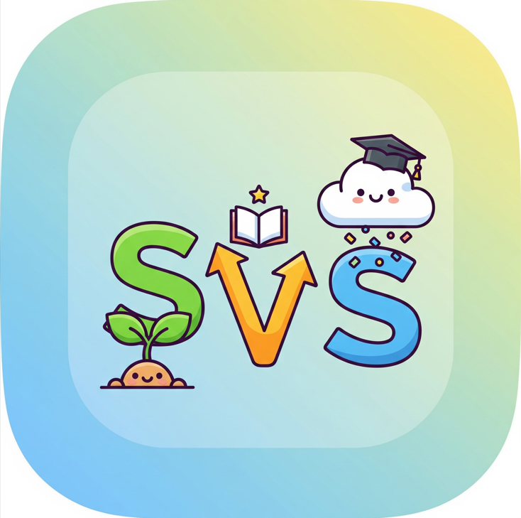
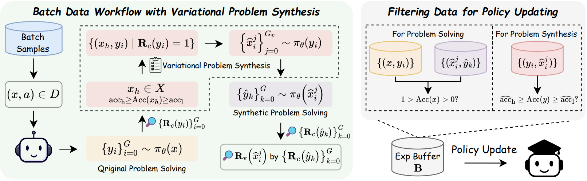
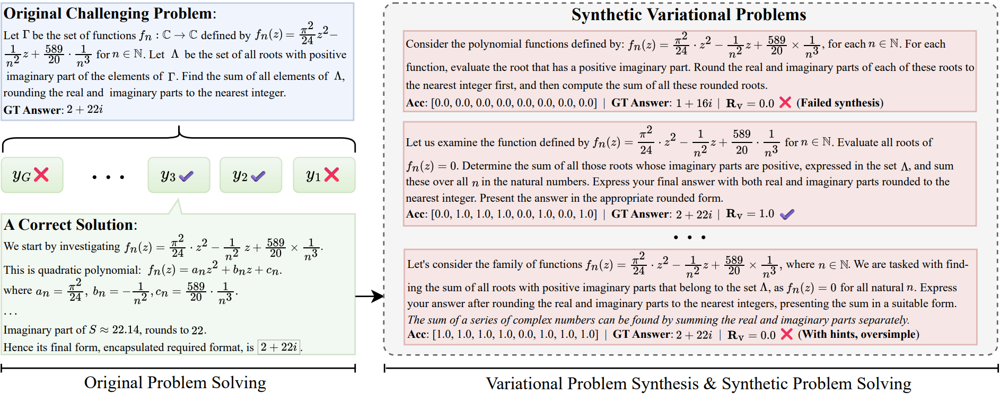

<h1 align="center">

<br>
<!-- <br style="display: block; content: ''; margin-top: 0.5em;" /> -->
SvS: Self-play with Variational problem Synthesis</span>
</h1>

<div align="center">


</div>

<p align="center">
  <a href="https://mastervito.github.io/SvS.github.io/"><b>[🌐 Website]</b></a> •
  <a href="https://huggingface.co/datasets/RLVR-SvS/Variational-DAPO"><b>[🤗 Dataset]</b></a> •
  <a href="https://arxiv.org/pdf/2508.14029v1"><b>[📜 Paper]</b></a> •
  <a href="https://github.com/MasterVito/SvS"><b>[🐱 GitHub]</b></a> •
  <a href="https://x.com/MasterVito0601/status/1959960582670766411"><b>[🐦 Twitter]</b></a> •
  <a href="https://www.xiaohongshu.com/discovery/item/68ac220f000000001d03b785?source=webshare&xhsshare=pc_web&xsec_token=ABgRNEq2SWHDpaqHQVIdEoTMd8NOnA-NAuilqp1VyEn0Y=&xsec_source=pc_share"><b>[📕 Rednote]</b></a>
</p>


<p align="center">
Repo for "<a href="https://arxiv.org/pdf/2508.14029v1" target="_blank">Beyond Pass@1: Self-Play with Variational Problem Synthesis Sustains RLVR</a>"
</p>

<br>

<p align="center">
    
        <br>
    <em>Figure 1: We train <a href="https://huggingface.co/Qwen/Qwen2.5-32B-Instruct">Qwen2.5-32B-Instruct</a> on the DAPO-17k dataset using our SVS strategy and standard RLVR. SvS achieves significant improvements in Pass@32 and Pass@1 (average 32 times) scores on AIME benchmarks.
    </em>
</p>


<!-- <br> -->

## 🔥 News

<!-- - [2023/10/13] 🔥🔥🔥 We release a demo for ToRA at [🐯 Gradio](https://9557c5365a6f44dc84.gradio.live), try it out!!! -->
<!-- - [2023/06/13] We release all prompts used in the SwS framework in <a href="https://github.com/MasterVito/SwS/tree/master/prompts"><b>prompts</b></a>.
- [2023/06/13] We update the demo set of synthetic problems from SwS in <a href="https://github.com/MasterVito/SwS/tree/master/datasets"><b>datasets</b></a>, including 500 samples for each model and category. You can also find them in <a href="https://huggingface.co/datasets/MasterVito/SwS-Demo-Dataset"><b>Demo Dataset</b></a>. -->
- [2025/08/25] **We provide the full code for training and evaluation for SvS.**
- [2025/08/19] **Our full code and datasets are under review by Microsoft and will be released upon approval.**
- [2025/08/19] SwS paper, repo, website and datasets (variational <a href="https://github.com/MasterVito/SwS/tree/master/prompts">DAPO-17k</a>) released.

<!-- <br> -->

## 💡 Introduction 

<div style="text-align: justify;">
<!-- The Self-aware Weakness-driven problem Synthesis framework (SwS) framework proposes to identifies model deficiencies and leverages them for problem augmentation. The weaknesses are defined as questions that the model consistently fails to learn through during RL training. SwS extracts the core concepts from these failure cases and synthesize new problems to strengthen the model's weak areas in subsequent augmented training, enabling it to focus on and gradually overcome its weaknesses. -->
The SvS framework leverages the policy itself to online augment training problems through self-play.
Specifically, the policy synthesizes variational problems from its correct solutions to under-performing training set problems and then attempts to solve these synthetic problems.
These variational problems preserve the semantics and, crucially, the ground-truth answers of the original ones, while their structures and descriptions may differ significantly, thereby eliciting novel or diverse reasoning strategies from the policy. 
Finally, <b>original problem solving</b>, <b>variational problem synthesis</b>, and <b>synthetic problem solving</b> are integrated for policy updating, enabling the model to jointly learn problem solving and synthesis.
Our SvS framework continuously maintains policy entropy within a narrow range and substantially improves <em>Pass@k</em> on AIME24 (<b>+18.3%</b>) and AIME25 (<b>+22.8%</b>).


</div>
<br>

<p align="center">
    
    <br>
    <em>Figure 2: The data workflow of our SVS in a training iteration, comprising original problem solving,
variational problem synthesis, synthetic problem solving, and policy update data filtering.
</em>
</p>

---

We present an example of variational problem synthesis and the reward-shaping strategy in the following figure. If a synthetic problem is either trivially solvable (too simple) or no solution aligning with the original answer (unsolvable) can be sampled, it receives a negative reward.

<p align="center">
    
    <br>
    <em>Figure 3: Illustrations of a challenging problem, its correct solution from policy, the synthetic variational problems from the solution, and the reward-shaping strategy for the synthetic problems.
</em>
</p>


<br>

## 📊 Experiments on Qwen2.5-32B-Instruct
<table border="1" cellspacing="0" cellpadding="5" style="border-collapse:collapse; text-align:center;">
  <thead>
    <tr>
      <th rowspan="2">Model</th>
      <th colspan="7" style="text-align:center;">Pass@1</th>
      <th colspan="7" style="text-align:center;">Pass@32</th>
    </tr>
    <tr>
      <th>AIME24</th><th>AIME25</th><th>BAIME</th><th>Math24o</th><th>OlymE</th><th>OlymH</th><th>Avg.</th>
      <th>AIME24</th><th>AIME25</th><th>BAIME</th><th>Math24o</th><th>OlymE</th><th>OlymH</th><th>Avg.</th>
    </tr>
  </thead>
  <tbody>
    <tr><th colspan="16" style="text-align:center;"><b><i>Open-Source Models</i></b></th></tr>
    <tr >
      <td>Qwen2.5-32B</td><td>4.3</td><td>1.2</td><td>2.4</td><td>8.0</td><td>3.7</td><td>1.6</td><td>3.5</td>
      <td>38.9</td><td>15.6</td><td>18.7</td><td>34.0</td><td>24.6</td><td>15.2</td><td>24.5</td>
    </tr>
    <tr >
      <td>Qwen2.5-32B-IT</td><td>10.0</td><td>13.0</td><td>7.4</td><td>26.0</td><td>8.6</td><td>2.0</td><td>11.2</td>
      <td>40.2</td><td>34.6</td><td>24.0</td><td>67.8</td><td>35.2</td><td>9.5</td><td>35.2</td>
    </tr>
    <tr >
      <td>SimpleRL-32B</td><td>22.1</td><td>13.9</td><td>8.3</td><td>25.5</td><td>9.4</td><td>3.7</td><td>13.8</td>
      <td>62.0</td><td>38.5</td><td>27.4</td><td>69.9</td><td>42.5</td><td>19.4</td><td>43.3</td>
    </tr>
    <tr >
      <td>ORZ-32B</td><td>24.2</td><td>26.3</td><td>10.9</td><td>16.1</td><td>12.2</td><td>1.1</td><td>15.1</td>
      <td>55.7</td><td>47.0</td><td>29.4</td><td>58.0</td><td>45.9</td><td>12.3</td><td>41.4</td>
    </tr>
    <tr><th colspan="16" style="text-align:center;"><b><i>MATH-12k</i></b></th></tr>
    <tr >
      <td>&rarr; RLVR</td><td>22.2</td><td>15.8</td><td>11.5</td><td>34.5</td><td>11.7</td><td><b>4.1</b></td><td>16.6</td>
      <td>47.4</td><td>36.4</td><td>29.2</td><td>66.0</td><td>36.2</td><td>16.4</td><td>38.6</td>
    </tr>
    <tr >
      <td>&rarr; SvS</td><td><b>30.3</b></td><td><b>21.7</b></td><td><b>13.8</b></td><td><b>42.7</b></td><td><b>20.1</b></td><td>3.3</td><td><b>22.0</b></td>
      <td><b>63.6</b></td><td><b>55.1</b></td><td><b>41.5</b></td><td><b>79.2</b></td><td><b>63.6</b></td><td><b>24.8</b></td><td><b>54.6</b></td>
    </tr>
    <tr >
      <td>&nbsp;&nbsp;&nbsp;&Delta;</td><td style="color:green;">+8.1</td><td style="color:green;">+5.9</td><td style="color:green;">+2.3</td><td style="color:green;">+8.2</td><td style="color:green;">+8.4</td><td style="color:red;">-0.8</td><td style="color:green;">+5.4</td>
      <td style="color:green;">+16.2</td><td style="color:green;">+18.7</td><td style="color:green;">+12.3</td><td style="color:green;">+13.2</td><td style="color:green;">+27.4</td><td style="color:green;">+8.4</td><td style="color:green;">+16.0</td>
    </tr>
    <tr><th colspan="16" style="text-align:center;"><b><i>DAPO-17k</i></b></th></tr>
    <tr >
      <td>&rarr; RLVR</td><td>28.8</td><td>30.0</td><td>14.0</td><td>39.6</td><td>17.9</td><td><b>4.8</b></td><td>22.5</td>
      <td>52.5</td><td>42.4</td><td>35.9</td><td>71.2</td><td><b>47.1</b></td><td><b>18.3</b></td><td>44.6</td>
    </tr>
    <tr >
      <td>&rarr; SvS</td><td><b>39.3</b></td><td><b>40.5</b></td><td><b>19.2</b></td><td><b>44.1</b></td><td><b>21.8</b></td><td>2.7</td><td><b>27.9</b></td>
      <td><b>70.8</b></td><td><b>65.2</b></td><td><b>45.9</b></td><td><b>76.5</b></td><td>43.4</td><td>16.7</td><td><b>53.1</b></td>
    </tr>
    <tr >
      <td>&nbsp;&nbsp;&nbsp;&Delta;</td><td style="color:green;">+10.5</td><td style="color:green;">+10.5</td><td style="color:green;">+5.2</td><td style="color:green;">+4.5</td><td style="color:green;">+3.9</td><td style="color:red;">-2.1</td><td style="color:green;">+5.4</td>
      <td style="color:green;">+18.3</td><td style="color:green;">+22.8</td><td style="color:green;">+10.0</td><td style="color:green;">+5.3</td><td style="color:red;">-3.7</td><td style="color:red;">-1.6</td><td style="color:green;">+8.5</td>
    </tr>
  </tbody>
</table>

<br>

## 🚀 Quick Start

### ⚙️ Setup

We recommend using [Conda](https://docs.conda.io/projects/miniconda) to manage your environment. We use [vLLM](https://github.com/vllm-project/vllm) (0.10.0) to accelerate inference. Run the following commands to setup your environment:

```sh
git git@github.com:MasterVito/SvS.git && cd SvS
conda create -n svs python=3.10.16
conda activate svs
pip install torch==2.7.1 --index-url https://download.pytorch.org/whl/cu126 # CUDA 12.6 for example
pip install -r requirements.txt
```

### 🪁 Evaluation

We provide a script for inference, simply config the `model_name_or_path` and `data_path` (default as using MATH-500 and AIME24 & AIME25 for evaluation) in [scripts/evaluation.sh](scripts/evaluation.sh) and run the following command:

```sh
bash scripts/evaluation.sh
```

### ⚡️ Training
We also open-source our complete training scripts for the community. We provide the training data used in our paper in [data](data). 
For example, to train the <a href="https://huggingface.co/Qwen/Qwen2.5-32B-Instruct">Qwen2.5-32B-Instruct</a> model, run the following command:

```sh
bash scripts/run_svs_qwen2.5_32b.sh
```

You can also train the <a href="https://huggingface.co/Qwen/Qwen2.5-3B-Instruct">Qwen2.5-3B-Instruct</a> and <a href="https://huggingface.co/meta-llama/Llama-3.1-8B-Instruct">Llama-3.1-8B-Instruct</a> models using the scripts provided in `scripts`.

<br>

## ☕️ Citation

If you find this repository helpful, please consider citing our paper:

```
@misc{liang2025svs,
      title={Beyond Pass@1: Self-Play with Variational Problem Synthesis Sustains RLVR}, 
      author={Xiao Liang and Zhongzhi Li and Yeyun Gong and Yelong Shen and Ying Nian Wu and Zhijiang Guo and Weizhu Chen},
      year={2025},
      eprint={2508.14029},
      archivePrefix={arXiv},
      primaryClass={cs.CL},
      url={https://arxiv.org/abs/2508.14029}, 
}
```
<br>

## 🙏 Acknowledgement
We sincerely appreciate the outstanding work of [veRL](https://github.com/volcengine/verl) and [SwS](https://github.com/MasterVito/SwS). The challenging problem augmentation strategy is inspired by SwS, and the training code is adapted from the veRL repository.

## 🌟 Star History

[](https://star-history.com/#mastervito/SwS&Date)
